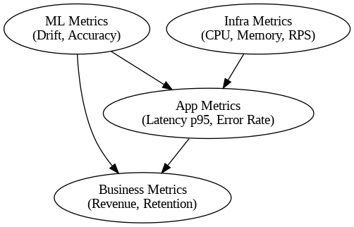
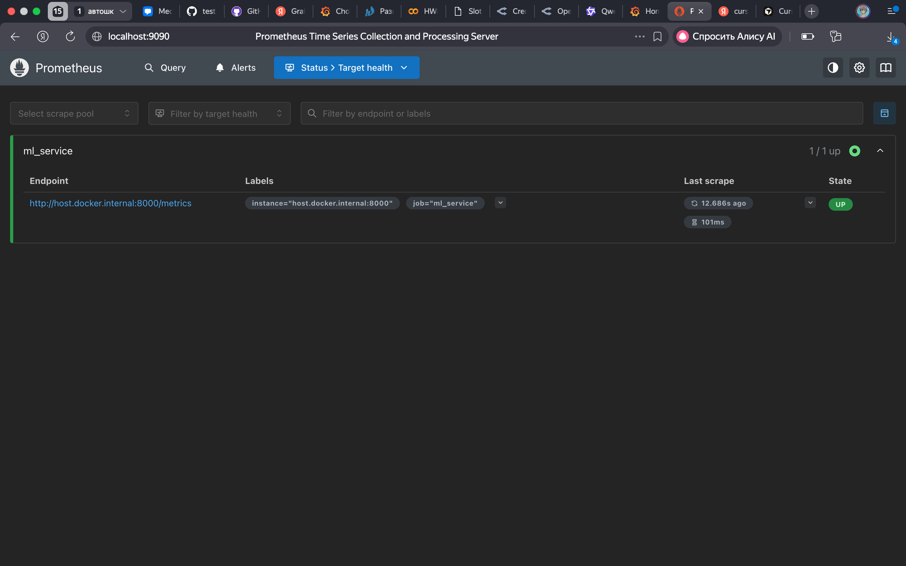
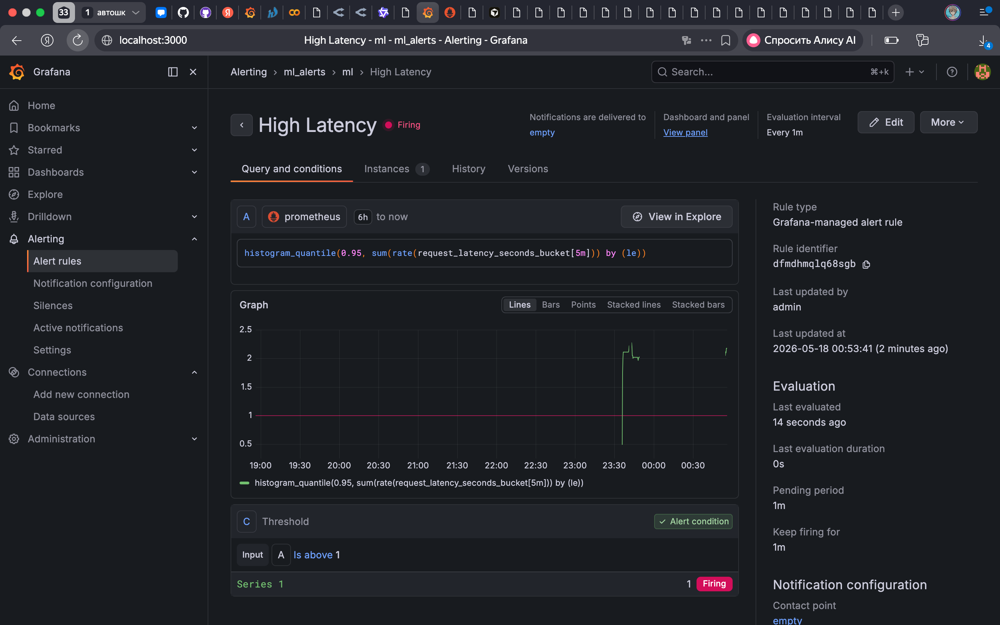
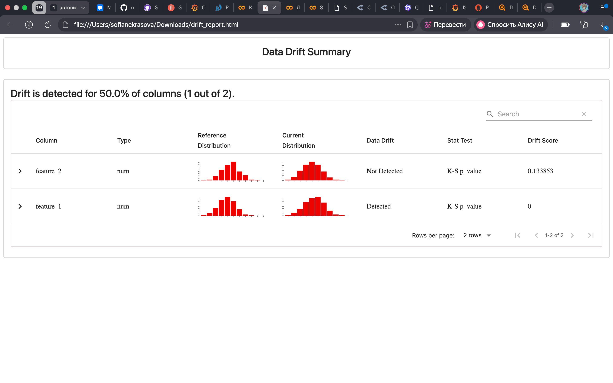
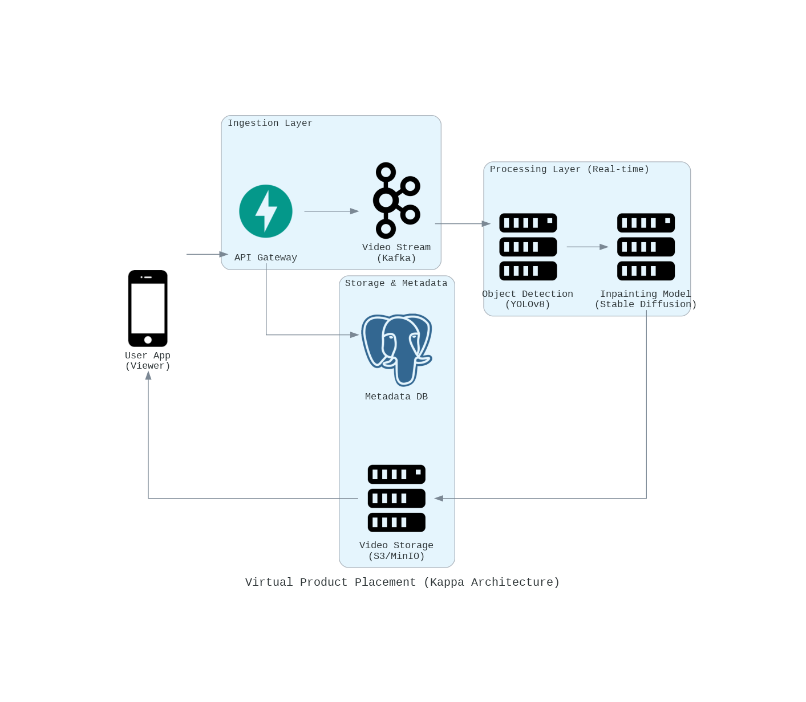

# Домашнее задание 8: Мониторинг ML-систем

**Студент:** Некрасова София

## 1. Метрики и SLO
Для системы онлайн-кинотеатра были определены ключевые метрики с учетом требований разных команд (Business, Dev, ML, DevOps).

**Выбранные SLO:**
*   **Latency (p95):** < 1 секунды.
*   **Error Rate:** < 1%.
*   **Availability:** > 99%.

## 2. Настройка Prometheus и Grafana
Мониторинг развернут локально с использованием Docker.
*   **ML-сервис:** FastAPI приложение, экспортирующее метрики задержки (`request_latency_seconds`) через `prometheus-client`.
*   **Prometheus:** Собирает метрики с сервиса.
*   **Grafana:** Визуализирует данные и управляет алертами.

### Конфигурация
Файлы конфигурации лежат в корне репозитория:
*   `prometheus.yml` — настройка скрейпинга.
*   `docker-compose.yml` — оркестрация контейнеров.
*   `grafana_dashboard.json` — экспорт дашборда с графиком P95 Latency.

### Дашборд
Все работает

### Алертинг
Настроен алерт `High Latency`, который срабатывает, если p95 задержки превышает 1 секунду в течение 1 минуты. Для теста искусственно увеличивалось время ответа модели (`time.sleep`).

## 3. Обнаружение дрифта данных (Evidently AI)
С помощью библиотеки `evidently` был сгенерирован отчет о дрифте данных.
*   **Reference data:** Нормальное распределение N(0, 1).
*   **Current data:** Сдвинутое распределение N(5, 1).

Отчет четко показывает статистически значимый дрифт по признаку `feature_1`.

*Код генерации отчета находится в блокноте .ipynb*

## 4. Качество данных (DQOps)

Задание не выполнено, тк DQOps потребовал лицензии

## 5. Архитектура Virtual Product Placement
Для задачи встраивания брендов в видеопоток в реальном времени выбрана **Kappa-архитектура**.

Причины выбора:
*   Видеопоток требует обработки в реальном времени с низкой задержкой.
*   Нет необходимости в сложном пакетном слое (как в Lambda), так как история видео не требует пересчета старых кадров для текущей рекламы.
*   Все данные проходят через единый поток (Kafka).

**Схема системы:**

## Как запустить
1.  Установить зависимости для сервиса: `pip install fastapi uvicorn prometheus-client`.
2.  Запустить сервис: `python main.py` (код сервиса можно найти в блокноте).
3.  Запустить инфраструктуру: `docker-compose up -d`.
4.  Открыть Grafana: `http://localhost:3000`.
